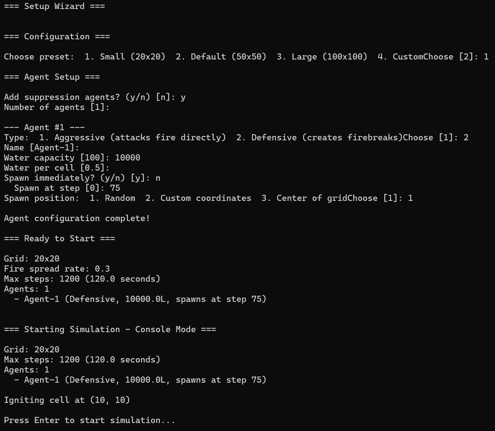
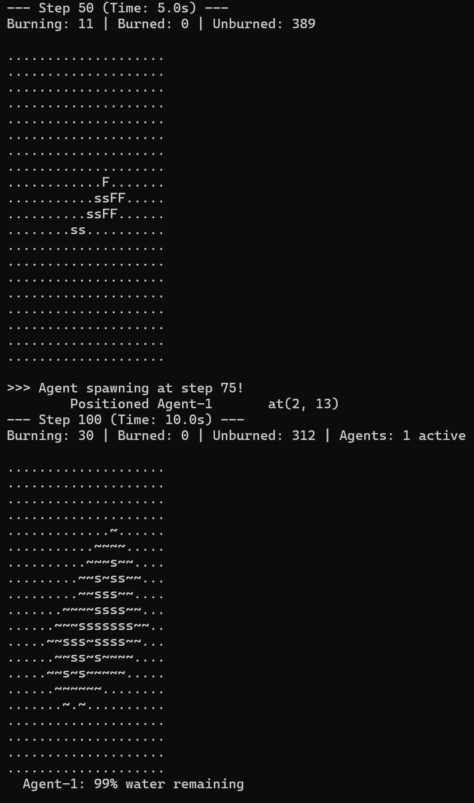
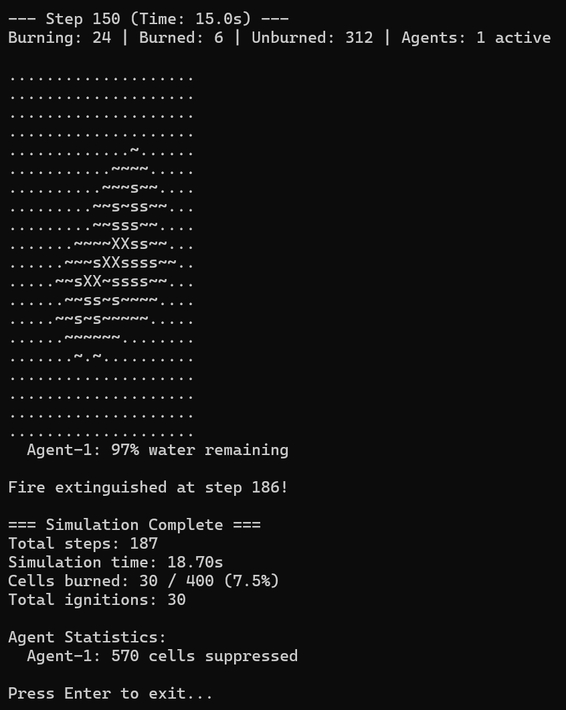

# Cascade - Wild Fire Spread Simulation Engine

> A configurable, agent-based wildfire simulation with both a console mode and an interactive GUI.


---

## Overview

Cascade simulates fire spreading across a cell grid under configurable environmental conditions (fuel, moisture, temperature). Suppression agents (aggressive or defensive) can be deployed to combat the fire in real time.

The simulation is driven by a fixed time-step loop and a pluggable fire model interface, making it straightforward to swap in different spread algorithms without touching the rest of the system.

---

## Features

- **Two run modes:** interactive SDL2 GUI or headless console output
- **Configurable grid:** small (20×20) to large (100×100) and beyond
- **Physics-influenced fire model:** spread probability accounts for wind direction/speed, fuel, moisture, diagonal penalties, and humidity
- **Suppression agents:** aggressive (chase fire) and defensive (protect perimeter) with configurable water capacity and delayed spawn steps
- **Observer pattern:** agents and stats hook into the simulation non-invasively
- **Deterministic mode:** fixed random seed for reproducible runs

---

## Screenshots





---

## Building

### Prerequisites

- CMake ≥ 3.15
- C++17 compiler
- [vcpkg](https://github.com/microsoft/vcpkg) (for dependency management)
- SDL2 *(optional - required for GUI mode)*

### Build

```bash
cmake -B build -S .
cmake --build build
```

To enable the GUI:

```bash
cmake -B build -S . -DCASCADE_GUI_ENABLED=ON
cmake --build build
```

---

## Usage

```bash
./Cascade
```

A setup wizard will walk you through:

1. **Mode:** Console or GUI (if SDL2 is available)
2. **Preset:** choose a grid size / simulation configuration
3. **Agents:** add suppression agents with type, water capacity, and optional spawn delay

Or launch directly into GUI mode:

```bash
./Cascade --gui
```

### GUI Controls

| Input | Action |
|---|---|
| Left click | Ignite cell |
| Right click | Extinguish cell |
| `SPACE` | Pause / Resume |
| `R` | Reset simulation |
| `ESC` | Exit |

---

## Configuration

All simulation behaviour is controlled through a single `Config` struct (`include/cascade/utils/config.hpp`). The key sub-configs are:

| Section | Key Parameters |
|---|---|
| `grid` | `width`, `height` |
| `fire` | `baseSpreadRate`, `burnRate`, `heatTransfer`, `coolingRate` |
| `fireModel` | `windInfluence`, `diagonalPenalty`, `humidityEffect` |
| `wind` | `direction`, `speed`, `enabled` |
| `suppression` | `defaultRange`, `defaultFlowRate`, `waterEffectiveness` |
| `simulation` | `timeStep`, `maxSteps`, `randomSeed`, `deterministicMode` |
| `gui` | `cellSize`, `targetFPS` |

Three built-in presets are available. A `ConfigBuilder` provides an interactive prompt-driven builder on top of these.

---

## Project Structure

```
Cascade/
├── include/cascade/
│   ├── core/          # Simulation orchestrator, stats, observer interface
│   ├── fire/          # FireModel interface + SimpleFireModel
│   ├── grid/          # Grid, Cell, CellState
│   ├── suppression/   # Agent base class, Aggressive/Defensive agents, factory
│   ├── gui/           # SDL renderer + GameUI
│   └── utils/         # Config, ConfigBuilder, Vector2D, validation
├── src/               # Implementations
├── tests/
└── docs/
```

---
